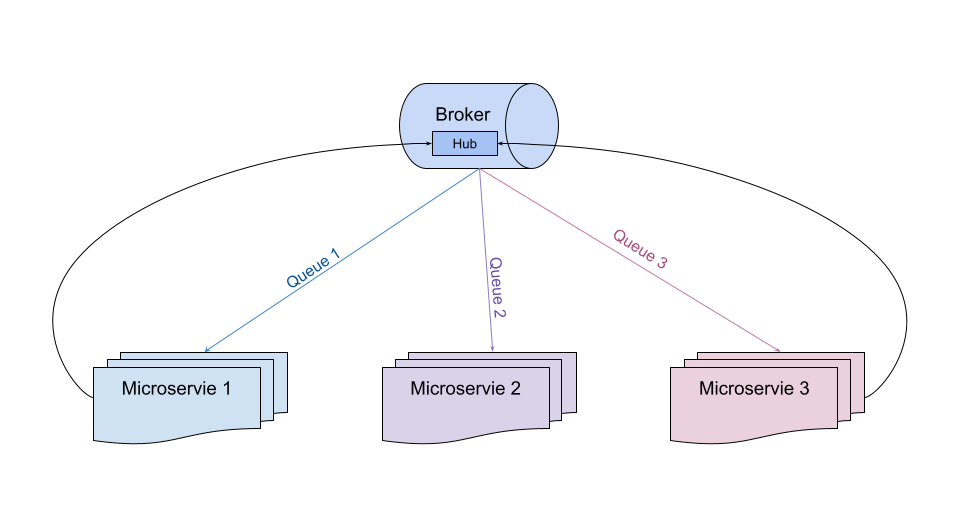

# Microservices - Big Picture

**Broker** - represents message broker which should have queues, exchanges and bindings

**Queues** - we create queues per microservice, if there are multiple instances of the same microservice they will use the same queue

**Hub Exchange** - We need to publish all messages in one exchange, as an example let's call it Hub Exchange

**Bindings** - filters messages from Hub Exchange to the queues based on some criterias. In queues we will receive only the messages which are necessary

# Message Shape

Each message has the folloing properties:

- **Route** - Original unique path for the specific message, based on the routes we define handlers

- **Payload** - Original content of the message, which was sent from the publisher

- **Metadata** - Additional attirbutes per message, can be added new attributes when message is in transit

# Ways to add new Messages

- **Publish** - we publish the new message for processing and process completes successfully once we will have confirmation that message is received by the broker.

- **Execute** - RPC call, first we do publishing and next we are waiting for the response for some amount of time
